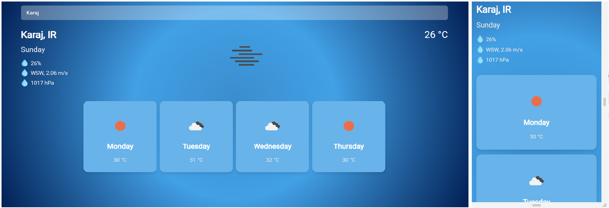

# Weather App

A plain js app that fetches weather information from external api


## Overview



## Installation
Open terminal where you want to install the project then run these commands
```
# copy project to your local machine
git clone https://github.com/alborzasd/weather-app

# change directory to project
cd weather-app

# run vscode in the current directory
code .
```
Now you should install the [Live Server](https://marketplace.visualstudio.com/items?itemName=ritwickdey.LiveServer) extension in vscode.
Then Press `Go Live` button at the bottom. You will see a live server on port 5500 starts running and new browser tab opens.